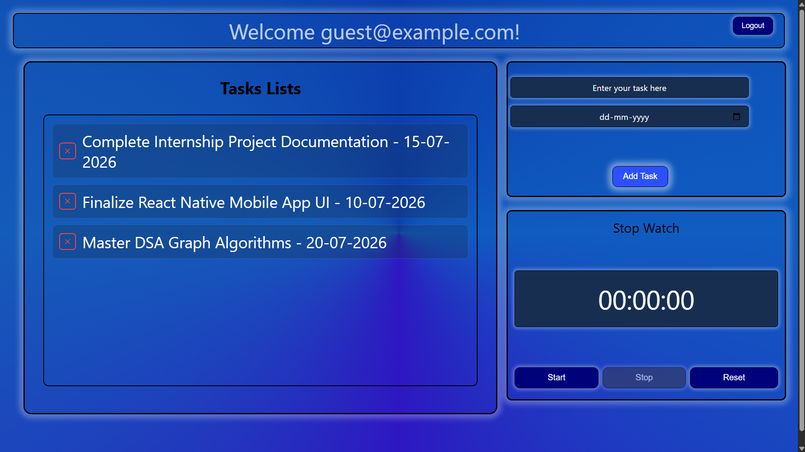

# 📝 Task Management & Productivity Tool

<div align="center">
  
  
  
  
</div>

<br>

A comprehensive productivity web application built to streamline daily workflows. This project was developed during my Web Development Internship at My Job Grow, focusing on dynamic state management, interactive user interfaces, and React components.

🔗 **[Live Demo](https://majorproject15.netlify.app/)**

## ✨ Features

* **User Dashboard:** Personalized greeting dashboard (e.g., "Welcome guest@example.com").
* **Dynamic Task Tracking:** Users can add, view, and organize daily tasks alongside specific dates.
* **Integrated Stopwatch:** A built-in, precise timer with Start, Stop, and Reset functionalities to track time spent on specific activities.
* **Modern UI:** Clean, responsive, and minimalist interface built entirely with React.

## 📸 Preview



## 🛠️ Tech Stack

* **Frontend:** ReactJS, HTML5, CSS3
* **Logic & State Management:** JavaScript (ES6+), React Hooks
* **Deployment:** Netlify

## 📁 Project Structure

```text
├── src/          # React frontend code (App.js, login.js, register.js, page.js)
├── public/       # Static assets
└── package.json  # Root package file managing dependencies
